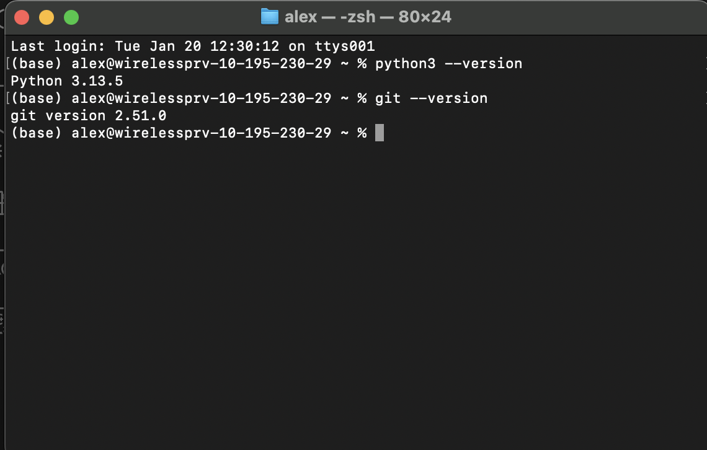
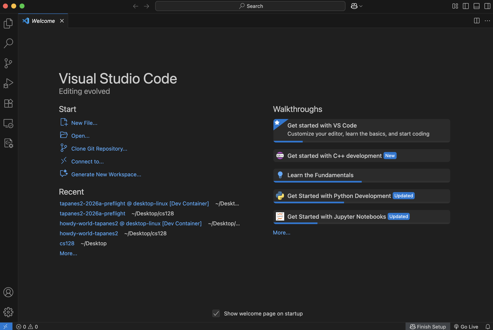

# Init IS310 Homework

## Proof of Installation

1. Python and Git

2. VS Code

3. Hypothesis Username: aTapanes

4. AI Tool/Workflow: Not planning on working with AI. If AI is used will use CoPilot and I'll use it to ask for "hints"/ ideas on how to think moving forward compared to asking for direct solutions.
